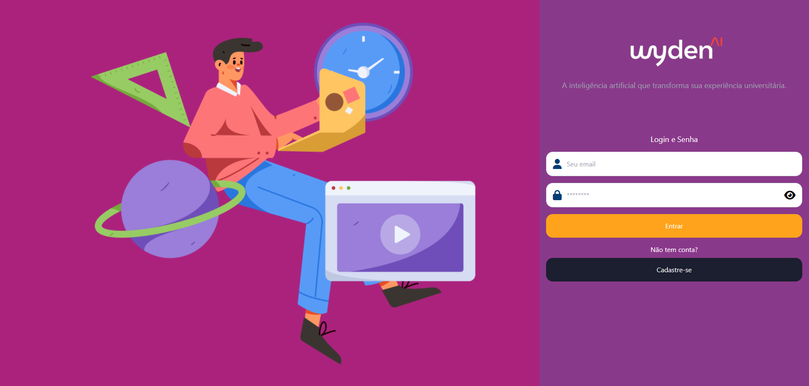
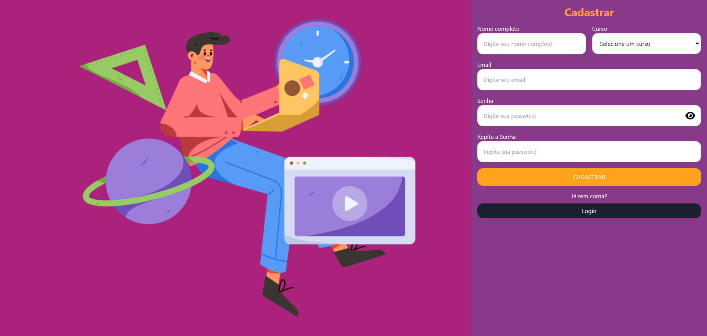
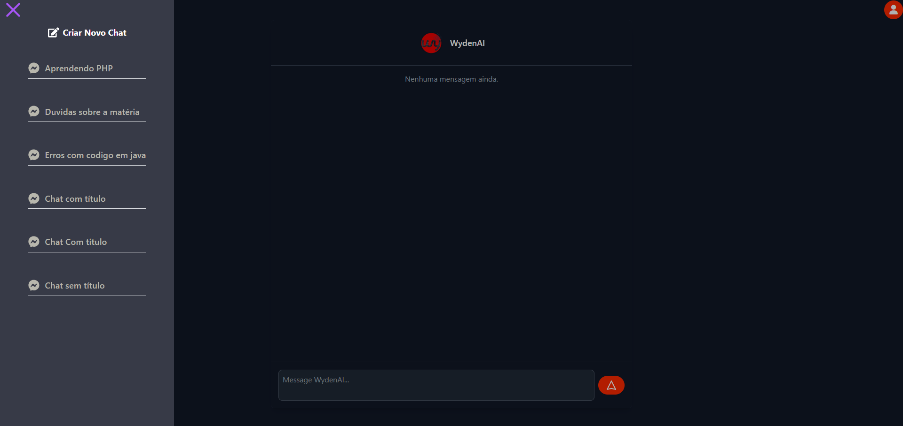
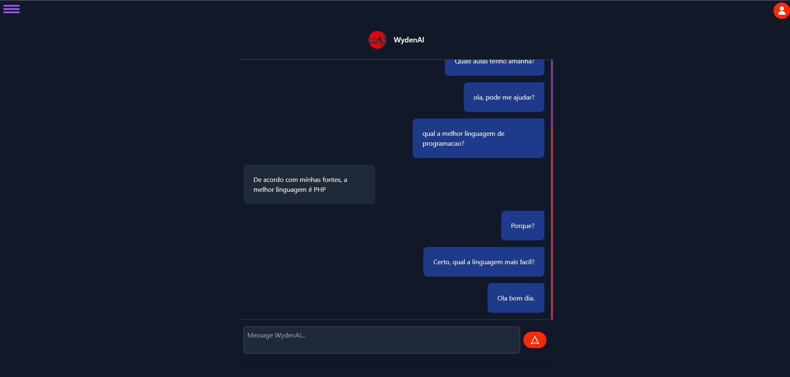
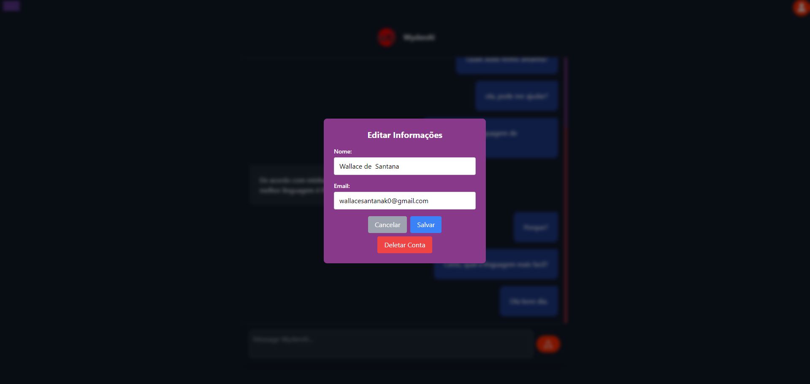

# 💬 Chat com IA - Front-end

Um projeto de chat interativo desenvolvido para conectar estudantes universitários e facilitar a aprendizagem. Este repositório contém o front-end da aplicação, criado com **React.js** e estilizado com **Tailwind CSS**. 🌟

---

## 🧠 Sobre o Projeto

O Chat com IA é uma aplicação que utiliza inteligência artificial para responder a perguntas e ajudar em dúvidas acadêmicas. 🎓  
Além disso, oferece um ambiente amigável e acessível para que calouros e veteranos possam explorar seus estudos.  

### 🚀 Tecnologias Utilizadas

- ⚛️ **React.js**: Biblioteca JavaScript para construção de interfaces de usuário.
- 🎨 **Tailwind CSS**: Framework de estilização para criar designs responsivos e modernos.
- 🔄 **Axios**: Biblioteca para realizar requisições HTTP de maneira simples e eficiente.
- 🌐 **PHP**: Back-end para gerenciar requisições e manipulação de dados.
- ☁️ **Google Cloud SQL**: Banco de dados em nuvem para armazenar informações como histórico de chat e dados de usuários.

---

## 📂 Estrutura do Projeto

```bash
src/
├── components/      # Componentes reutilizáveis, como Navbar e botões
├── services/        # Serviços para comunicação com o back-end
├── screens/         # As telas que o projeto tem
├── routes.jsx       # As rotas de navegação usadas pelo projeto
└── App.js           # Ponto de entrada da aplicação
```
## 🖥️ Pré-visualização

-  🔧 Navbar do Chat: Oferece uma navegação intuitiva entre chats e opções de edição.

-  ⚙️ Interface de Usuário: Simples, elegante e responsiva para todos os dispositivos.

-  📊 Histórico de Chat: Salva e organiza os chats para referência futura.

## 🖼️ Screenshots

- ### Login


- ### Cadastro


- ### Chat Menu

- ### Chat Display

### User Edit



## ⚡ Funcionalidades
- 📩 Autenticação: Login e registro de usuários com validação de dados.
- 💬 Novo Chat: Criação de chats com apenas um clique.
- ✏️ Edição de Chats: Permite renomear títulos diretamente na interface.
- 🗑️ Deletar Chats: Gerencie seus chats de forma eficiente.
- 📚 Histórico: Acompanhe todas as interações no sistema.

## Como Rodar o Projeto
**Pré-requisitos**:
Node.js (v16 ou superior)
Yarn ou npm
- 1. Clone o repositório:
```bash
git clone https://github.com/wallacemt/wydenai-client.git
```
- 2. Acesse a pasta do projeto:
```bash
cd wydenai-client
```
- 3 Instale as dependências:
```bash
npm install ou yarn install
```
- 5. Acesse no navegador: http://localhost:5173

# 📧 Contato
- Desenvolvido em conjunto com minha equipe. Entre em contato para dúvidas ou sugestões:
- 📩 wallacesantanak0@gmail.com

### 🎉 Contribuições são bem-vindas!

